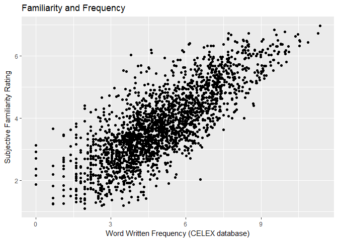
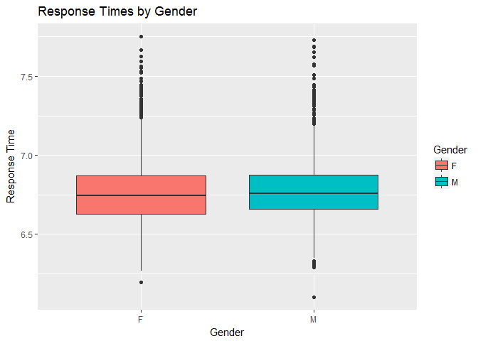
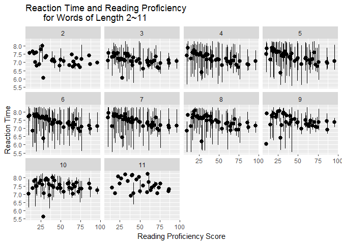

#bivariate scatterplot 


```r
library(knitr)
library(tidyverse)
```

```
## -- Attaching packages ----------------------------- tidyverse 1.2.1 --
```

```
## v ggplot2 2.2.1     v purrr   0.2.4
## v tibble  1.4.1     v dplyr   0.7.4
## v tidyr   0.7.2     v stringr 1.2.0
## v readr   1.1.1     v forcats 0.2.0
```

```
## -- Conflicts -------------------------------- tidyverse_conflicts() --
## x dplyr::filter() masks stats::filter()
## x dplyr::lag()    masks stats::lag()
```

```r
library(languageR)
ggplot(data = english) +
  geom_point(mapping= aes(x = WrittenFrequency, y = Familiarity)) +
  labs(x = "Word Written Frequency (CELEX database)", 
       y = "Subjective Familiarity Rating",
       title = "Familiarity and Frequency")
```

<!-- -->

#boxplot with different fill colors


```r
library(knitr)
library(tidyverse)
library(languageR)
str(danish)
```

```
## 'data.frame':	3326 obs. of  16 variables:
##  $ Subject       : Factor w/ 22 levels "2s01","2s02",..: 14 17 15 4 6 11 12 21 10 3 ...
##  $ Word          : Factor w/ 156 levels "appetitlig","arkiv",..: 1 1 1 1 1 1 1 1 1 1 ...
##  $ Affix         : Factor w/ 16 levels "bar","ede","en",..: 13 13 13 13 13 13 13 13 13 13 ...
##  $ LogRT         : num  6.45 6.84 6.84 6.83 6.8 ...
##  $ PC1           : num  0.544 1.129 0.655 -1.26 0.167 ...
##  $ PC2           : num  -0.233 -0.486 0.247 -2.433 0.443 ...
##  $ PrevError     : Factor w/ 2 levels "CORRECT","ERROR": 1 1 1 1 1 1 1 1 1 1 ...
##  $ Rank          : num  1.129 -0.838 -0.757 0.85 0.102 ...
##  $ Sex           : Factor w/ 2 levels "F","M": 2 2 2 2 1 2 1 1 2 2 ...
##  $ ResidSemRating: num  -1.23 -1.23 -1.23 -1.23 -1.23 ...
##  $ ResidFamSize  : num  -1.6 -1.6 -1.6 -1.6 -1.6 ...
##  $ LogWordFreq   : num  2.94 2.94 2.94 2.94 2.94 ...
##  $ LogAffixFreq  : num  13.4 13.4 13.4 13.4 13.4 ...
##  $ LogCUP        : num  6.46 6.46 6.46 6.46 6.46 ...
##  $ LogUP         : num  5.32 5.32 5.32 5.32 5.32 ...
##  $ LogCUPtoEnd   : num  4.3 4.3 4.3 4.3 4.3 ...
```

```r
ggplot(data = danish) +
  geom_boxplot(mapping= aes(x = Sex, y = LogRT, fill = Sex)) +
  labs(x = "Gender", 
       y = "Response Time",
       title = "Response Times by Gender",
       fill = "Gender")
```

<!-- -->

#stat_summary / facet plot


```r
library(knitr)
library(tidyverse)
library(languageR)
ggplot(data = beginningReaders) + 
  stat_summary(
    mapping = aes(x = ReadingScore, y = LogRT),
    fun.ymin = min,
    fun.ymax = max,
    fun.y = median,
    geom = "pointrange"
  ) +
  facet_wrap(~ OrthLength)+
  labs(x = "Reading Proficiency Score",
       y = "Reaction Time",
       title = "Reaction Time and Reading Proficiency 
       for Words of Length 2~11")
```

<!-- -->
