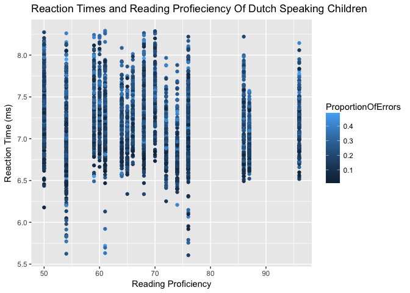
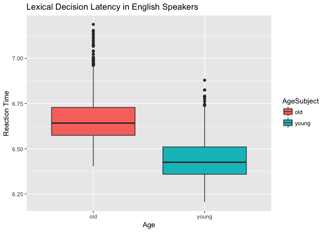
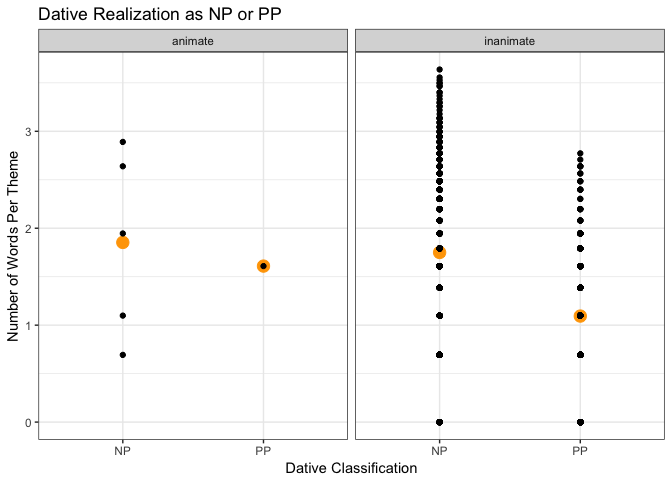

## Practice graphing with ggplot


```r
library(tidyverse)
```

```
## ── Attaching packages ───────────────────────── tidyverse 1.2.1 ──
```

```
## ✔ ggplot2 2.2.1     ✔ purrr   0.2.4
## ✔ tibble  1.3.4     ✔ dplyr   0.7.4
## ✔ tidyr   0.7.2     ✔ stringr 1.2.0
## ✔ readr   1.1.1     ✔ forcats 0.2.0
```

```
## ── Conflicts ──────────────────────────── tidyverse_conflicts() ──
## ✖ dplyr::filter() masks stats::filter()
## ✖ dplyr::lag()    masks stats::lag()
```

```r
library(languageR)

#scatterplot 
#plot indicates perhaps scatterplot is not best representation of these variables? 
beginningReaders %>%
  select(., ReadingScore, LogRT, ProportionOfErrors)%>%
  filter(., ReadingScore >= 50)%>%
  ggplot(., aes(x = ReadingScore, y = LogRT, color = ProportionOfErrors))+
  geom_point()+
  labs(y = "Reaction Time (ms)", x = "Reading Proficiency", title = "Reaction Times and Reading Profieciency Of Dutch Speaking Children") 
```

<!-- -->

```r
#boxplot
english %>%
  select(., AgeSubject, RTlexdec) %>%
  ggplot(., aes(x = AgeSubject, y= RTlexdec, fill = AgeSubject)) +
  geom_boxplot() +
  labs(y = "Reaction Time", x = "Age", title = "Lexical Decision Latency in English Speakers")
```

<!-- -->

```r
#scatterplot with stat summary and facet 
dativeSimplified %>%
  select(., RealizationOfRec, LengthOfTheme, AnimacyOfRec, AnimacyOfTheme)%>%
  ggplot(., aes(x = as.factor(RealizationOfRec), y = LengthOfTheme)) +
  stat_summary(fun.y = mean, geom = "point", size = 4, color = 'orange') +
  geom_point(stat = 'identity') +
  facet_grid(. ~ AnimacyOfTheme)+
  labs(y = "Number of Words Per Theme", x = "Dative Classification", title = "Dative Realization as NP or PP") +
  theme_bw()
```

<!-- -->

Note that the `echo = FALSE` parameter was added to the code chunk to prevent printing of the R code that generated the plot.
