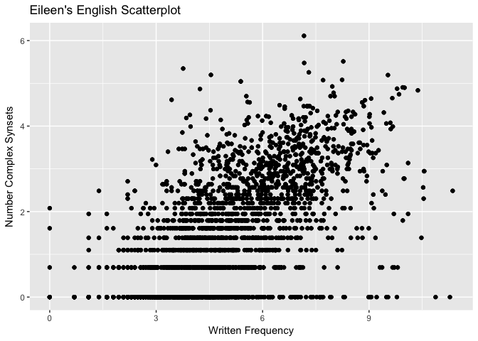
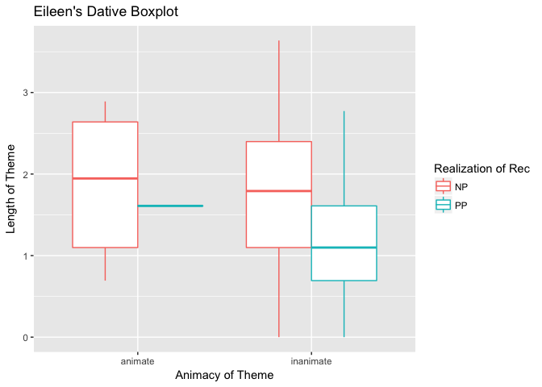
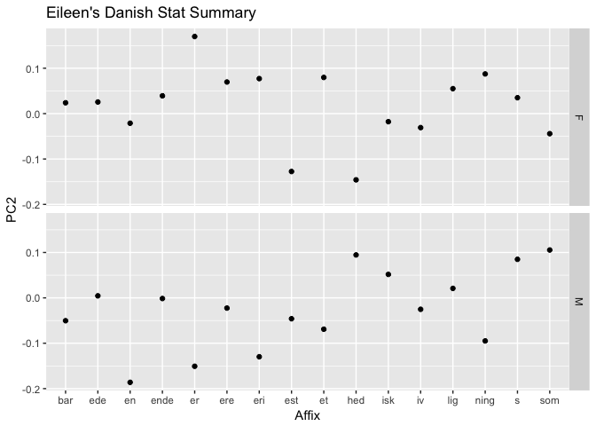

## R Markdown

```
## ── Attaching packages ───────────────
```

```
## ✔ ggplot2 2.2.1     ✔ purrr   0.2.4
## ✔ tibble  1.4.1     ✔ dplyr   0.7.4
## ✔ tidyr   0.7.2     ✔ stringr 1.2.0
## ✔ readr   1.1.1     ✔ forcats 0.2.0
```

```
## ── Conflicts ────────────────────────
## ✖ dplyr::filter() masks stats::filter()
## ✖ dplyr::lag()    masks stats::lag()
```


#Bivariate scatterplot

```r
summary(english)
```

```
##     RTlexdec        RTnaming      Familiarity         Word     
##  Min.   :6.205   Min.   :6.022   Min.   :1.100   arm    :   4  
##  1st Qu.:6.426   1st Qu.:6.149   1st Qu.:3.000   barge  :   4  
##  Median :6.550   Median :6.342   Median :3.700   bark   :   4  
##  Mean   :6.550   Mean   :6.323   Mean   :3.796   bear   :   4  
##  3rd Qu.:6.653   3rd Qu.:6.490   3rd Qu.:4.570   beef   :   4  
##  Max.   :7.188   Max.   :6.696   Max.   :6.970   bind   :   4  
##                                                  (Other):4544  
##  AgeSubject   WordCategory WrittenFrequency WrittenSpokenFrequencyRatio
##  old  :2284   N:2904       Min.   : 0.000   Min.   :-6.55393           
##  young:2284   V:1664       1st Qu.: 3.761   1st Qu.:-0.07402           
##                            Median : 4.832   Median : 0.68118           
##                            Mean   : 5.021   Mean   : 0.67763           
##                            3rd Qu.: 6.247   3rd Qu.: 1.44146           
##                            Max.   :11.357   Max.   : 5.63071           
##                                                                        
##    FamilySize     DerivationalEntropy InflectionalEntropy
##  Min.   :0.6931   Min.   :0.00000     Min.   :0.0000     
##  1st Qu.:1.0986   1st Qu.:0.03932     1st Qu.:0.7442     
##  Median :1.7918   Median :0.41097     Median :1.0982     
##  Mean   :1.8213   Mean   :0.54089     Mean   :1.1186     
##  3rd Qu.:2.3026   3rd Qu.:0.89323     3rd Qu.:1.6325     
##  Max.   :5.5175   Max.   :5.20728     Max.   :2.4514     
##                                                          
##  NumberSimplexSynsets NumberComplexSynsets LengthInLetters
##  Min.   :0.000        Min.   :0.000        Min.   :2.000  
##  1st Qu.:1.099        1st Qu.:0.000        1st Qu.:4.000  
##  Median :1.609        Median :1.386        Median :4.000  
##  Mean   :1.708        Mean   :1.568        Mean   :4.342  
##  3rd Qu.:2.197        3rd Qu.:2.565        3rd Qu.:5.000  
##  Max.   :4.357        Max.   :6.111        Max.   :7.000  
##                                                           
##      Ncount       MeanBigramFrequency FrequencyInitialDiphone
##  Min.   : 0.000   Min.   : 5.390      Min.   : 4.143         
##  1st Qu.: 2.000   1st Qu.: 8.100      1st Qu.:11.277         
##  Median : 5.000   Median : 8.559      Median :12.023         
##  Mean   : 6.266   Mean   : 8.490      Mean   :11.963         
##  3rd Qu.: 9.000   3rd Qu.: 8.973      3rd Qu.:12.697         
##  Max.   :22.000   Max.   :10.283      Max.   :14.654         
##                                                              
##     ConspelV        ConspelN         ConphonV        ConphonN     
##  Min.   : 0.00   Min.   : 0.000   Min.   : 0.00   Min.   : 0.000  
##  1st Qu.: 6.00   1st Qu.: 4.519   1st Qu.:10.00   1st Qu.: 5.268  
##  Median :11.00   Median : 5.710   Median :16.00   Median : 6.340  
##  Mean   :11.71   Mean   : 5.605   Mean   :18.26   Mean   : 6.318  
##  3rd Qu.:17.00   3rd Qu.: 6.997   3rd Qu.:24.00   3rd Qu.: 7.491  
##  Max.   :32.00   Max.   :10.492   Max.   :66.00   Max.   :10.600  
##                                                                   
##   ConfriendsV     ConfriendsN         ConffV           ConffN      
##  Min.   : 0.00   Min.   : 0.000   Min.   :0.0000   Min.   : 0.000  
##  1st Qu.: 4.00   1st Qu.: 4.159   1st Qu.:0.0000   1st Qu.: 0.000  
##  Median :10.00   Median : 5.487   Median :0.0000   Median : 0.000  
##  Mean   :10.42   Mean   : 5.265   Mean   :0.4109   Mean   : 1.308  
##  3rd Qu.:15.00   3rd Qu.: 6.642   3rd Qu.:0.6931   3rd Qu.: 1.386  
##  Max.   :31.00   Max.   :10.303   Max.   :3.3322   Max.   :10.347  
##                                                                    
##      ConfbV           ConfbN       NounFrequency      VerbFrequency     
##  Min.   :0.0000   Min.   : 0.000   Min.   :    0.00   Min.   :     0.0  
##  1st Qu.:0.6931   1st Qu.: 0.000   1st Qu.:   28.75   1st Qu.:     0.0  
##  Median :1.3863   Median : 4.143   Median :  108.00   Median :    30.0  
##  Mean   :1.5570   Mean   : 3.890   Mean   :  600.19   Mean   :   881.0  
##  3rd Qu.:2.5649   3rd Qu.: 6.242   3rd Qu.:  424.75   3rd Qu.:   164.2  
##  Max.   :4.1897   Max.   :10.600   Max.   :35351.00   Max.   :242066.0  
##                                                                         
##  CV       Obstruent       Frication          Voice     
##  C:4446   cont:1068   burst    :1840   voiced   :2060  
##  V: 122   obst:3500   frication:1660   voiceless:2508  
##                       long     :  88                   
##                       short    : 980                   
##                                                        
##                                                        
##                                                        
##  FrequencyInitialDiphoneWord FrequencyInitialDiphoneSyllable
##  Min.   : 3.091              Min.   : 3.367                 
##  1st Qu.: 9.557              1st Qu.:10.000                 
##  Median :10.517              Median :10.972                 
##  Mean   :10.359              Mean   :10.789                 
##  3rd Qu.:11.320              3rd Qu.:11.703                 
##  Max.   :13.925              Max.   :13.930                 
##                                                             
##  CorrectLexdec  
##  Min.   : 1.00  
##  1st Qu.:27.00  
##  Median :29.00  
##  Mean   :27.05  
##  3rd Qu.:30.00  
##  Max.   :30.00  
## 
```

```r
str(english)
```

```
## 'data.frame':	4568 obs. of  36 variables:
##  $ RTlexdec                       : num  6.54 6.4 6.3 6.42 6.45 ...
##  $ RTnaming                       : num  6.15 6.25 6.14 6.13 6.2 ...
##  $ Familiarity                    : num  2.37 4.43 5.6 3.87 3.93 3.27 3.73 5.67 3.1 4.43 ...
##  $ Word                           : Factor w/ 2197 levels "ace","act","add",..: 467 2124 1838 1321 1302 1347 434 468 15 1632 ...
##  $ AgeSubject                     : Factor w/ 2 levels "old","young": 2 2 2 2 2 2 2 2 2 2 ...
##  $ WordCategory                   : Factor w/ 2 levels "N","V": 1 1 1 1 1 1 1 1 1 1 ...
##  $ WrittenFrequency               : num  3.91 4.52 6.51 5.02 4.89 ...
##  $ WrittenSpokenFrequencyRatio    : num  1.022 0.35 2.089 -0.526 -1.045 ...
##  $ FamilySize                     : num  1.39 1.39 1.61 1.95 2.2 ...
##  $ DerivationalEntropy            : num  0.141 0.427 0.062 0.43 0.359 ...
##  $ InflectionalEntropy            : num  0.0211 0.942 1.4434 0 1.7539 ...
##  $ NumberSimplexSynsets           : num  0.693 1.099 2.485 1.099 2.485 ...
##  $ NumberComplexSynsets           : num  0 0 1.95 2.64 2.48 ...
##  $ LengthInLetters                : int  3 5 6 4 4 4 4 3 3 5 ...
##  $ Ncount                         : int  8 5 0 8 3 9 6 13 3 3 ...
##  $ MeanBigramFrequency            : num  7.04 9.54 9.88 8.31 7.94 ...
##  $ FrequencyInitialDiphone        : num  12 12.6 13.3 12.1 11.9 ...
##  $ ConspelV                       : int  10 20 10 5 17 19 10 13 1 7 ...
##  $ ConspelN                       : num  3.74 7.87 6.69 6.68 4.76 ...
##  $ ConphonV                       : int  41 38 13 6 17 21 13 7 11 14 ...
##  $ ConphonN                       : num  8.84 9.78 7.04 3.83 4.76 ...
##  $ ConfriendsV                    : int  8 20 10 4 17 19 10 6 0 7 ...
##  $ ConfriendsN                    : num  3.3 7.87 6.69 3.53 4.76 ...
##  $ ConffV                         : num  0.693 0 0 0.693 0 ...
##  $ ConffN                         : num  2.71 0 0 6.63 0 ...
##  $ ConfbV                         : num  3.5 2.94 1.39 1.1 0 ...
##  $ ConfbN                         : num  8.83 9.61 5.82 2.56 0 ...
##  $ NounFrequency                  : int  49 142 565 150 170 125 582 2061 144 522 ...
##  $ VerbFrequency                  : int  0 0 473 0 120 280 110 76 4 86 ...
##  $ CV                             : Factor w/ 2 levels "C","V": 1 1 1 1 1 1 1 1 2 1 ...
##  $ Obstruent                      : Factor w/ 2 levels "cont","obst": 2 2 2 2 2 2 2 2 1 2 ...
##  $ Frication                      : Factor w/ 4 levels "burst","frication",..: 1 2 2 1 1 1 1 1 3 2 ...
##  $ Voice                          : Factor w/ 2 levels "voiced","voiceless": 1 2 2 2 2 2 1 1 1 2 ...
##  $ FrequencyInitialDiphoneWord    : num  10.13 9.05 12.42 10.05 11.8 ...
##  $ FrequencyInitialDiphoneSyllable: num  10.41 9.15 13.13 11 12.16 ...
##  $ CorrectLexdec                  : int  27 30 30 30 26 28 30 28 25 29 ...
```

```r
english %>%
  ggplot(., aes(x = WrittenFrequency, y = NumberComplexSynsets)) +
    geom_point() + 
    labs(x = "Written Frequency", y = "Number Complex Synsets", title = "Eileen's English Scatterplot")
```

<!-- -->

#Boxplot with different colors

```r
summary(dativeSimplified)
```

```
##  RealizationOfRec      Verb        AnimacyOfRec   AnimacyOfTheme
##  NP:555           give   :403   animate  :822   animate  :  6   
##  PP:348           sell   :130   inanimate: 81   inanimate:897   
##                   pay    : 66                                   
##                   offer  : 49                                   
##                   send   : 33                                   
##                   cost   : 32                                   
##                   (Other):190                                   
##  LengthOfTheme   
##  Min.   :0.0000  
##  1st Qu.:0.6931  
##  Median :1.6094  
##  Mean   :1.4982  
##  3rd Qu.:2.0794  
##  Max.   :3.6376  
## 
```

```r
str(dativeSimplified)
```

```
## 'data.frame':	903 obs. of  5 variables:
##  $ RealizationOfRec: Factor w/ 2 levels "NP","PP": 1 1 1 1 1 1 1 1 1 1 ...
##  $ Verb            : Factor w/ 65 levels "accord","allocate",..: 19 23 23 23 36 23 38 9 59 23 ...
##  $ AnimacyOfRec    : Factor w/ 2 levels "animate","inanimate": 1 1 1 1 1 1 1 1 1 1 ...
##  $ AnimacyOfTheme  : Factor w/ 2 levels "animate","inanimate": 2 2 2 2 2 2 2 2 2 2 ...
##  $ LengthOfTheme   : num  2.64 1.1 2.56 1.61 1.1 ...
```

```r
dativeSimplified %>% 
  ggplot(., aes(x = AnimacyOfTheme, y = LengthOfTheme, color = RealizationOfRec)) + 
    geom_boxplot() + 
    labs(x = "Animacy of Theme", y = "Length of Theme", color = "Realization of Rec", title = "Eileen's Dative Boxplot")
```

<!-- -->

#Plot of your choice including stat_summary and a facet

```r
summary(danish)
```

```
##     Subject             Word          Affix          LogRT      
##  2s08   : 155   appetitlig:  22   est    : 217   Min.   :6.100  
##  2s02   : 154   baroner   :  22   isk    : 217   1st Qu.:6.643  
##  2s11   : 154   bF8jning  :  22   et     : 216   Median :6.748  
##  2s18   : 154   blokere   :  22   ede    : 215   Mean   :6.770  
##  2s21   : 154   blomster  :  22   hed    : 215   3rd Qu.:6.873  
##  2s10   : 153   bryggeri  :  22   er     : 214   Max.   :7.752  
##  (Other):2402   (Other)   :3194   (Other):2032                  
##       PC1               PC2             PrevError         Rank          
##  Min.   :-6.3661   Min.   :-7.30414   CORRECT:3182   Min.   :-1.689590  
##  1st Qu.:-0.3934   1st Qu.:-0.46991   ERROR  : 144   1st Qu.:-0.882087  
##  Median : 0.1915   Median : 0.01951                  Median :-0.001174  
##  Mean   : 0.0000   Mean   : 0.00000                  Mean   : 0.000000  
##  3rd Qu.: 0.6469   3rd Qu.: 0.48517                  3rd Qu.: 0.850375  
##  Max.   : 2.1024   Max.   : 5.65189                  Max.   : 1.738628  
##                                                                         
##  Sex      ResidSemRating       ResidFamSize        LogWordFreq   
##  F:1972   Min.   :-3.550223   Min.   :-5.284262   Min.   :0.000  
##  M:1354   1st Qu.:-1.065771   1st Qu.:-0.826234   1st Qu.:3.466  
##           Median : 0.282918   Median : 0.065899   Median :4.860  
##           Mean   : 0.004871   Mean   : 0.007872   Mean   :4.898  
##           3rd Qu.: 1.339696   3rd Qu.: 0.919535   3rd Qu.:6.196  
##           Max.   : 2.523988   Max.   : 3.178727   Max.   :9.736  
##                                                                  
##   LogAffixFreq        LogCUP          LogUP        LogCUPtoEnd   
##  Min.   : 9.066   Min.   :5.565   Min.   :5.037   Min.   :0.000  
##  1st Qu.:11.004   1st Qu.:5.994   1st Qu.:5.478   1st Qu.:4.078  
##  Median :12.416   Median :6.129   Median :5.659   Median :4.898  
##  Mean   :12.000   Mean   :6.131   Mean   :5.661   Mean   :4.173  
##  3rd Qu.:13.395   3rd Qu.:6.267   3rd Qu.:5.849   3rd Qu.:5.236  
##  Max.   :14.060   Max.   :6.525   Max.   :6.170   Max.   :5.805  
## 
```

```r
str(danish)
```

```
## 'data.frame':	3326 obs. of  16 variables:
##  $ Subject       : Factor w/ 22 levels "2s01","2s02",..: 14 17 15 4 6 11 12 21 10 3 ...
##  $ Word          : Factor w/ 156 levels "appetitlig","arkiv",..: 1 1 1 1 1 1 1 1 1 1 ...
##  $ Affix         : Factor w/ 16 levels "bar","ede","en",..: 13 13 13 13 13 13 13 13 13 13 ...
##  $ LogRT         : num  6.45 6.84 6.84 6.83 6.8 ...
##  $ PC1           : num  0.544 1.129 0.655 -1.26 0.167 ...
##  $ PC2           : num  -0.233 -0.486 0.247 -2.433 0.443 ...
##  $ PrevError     : Factor w/ 2 levels "CORRECT","ERROR": 1 1 1 1 1 1 1 1 1 1 ...
##  $ Rank          : num  1.129 -0.838 -0.757 0.85 0.102 ...
##  $ Sex           : Factor w/ 2 levels "F","M": 2 2 2 2 1 2 1 1 2 2 ...
##  $ ResidSemRating: num  -1.23 -1.23 -1.23 -1.23 -1.23 ...
##  $ ResidFamSize  : num  -1.6 -1.6 -1.6 -1.6 -1.6 ...
##  $ LogWordFreq   : num  2.94 2.94 2.94 2.94 2.94 ...
##  $ LogAffixFreq  : num  13.4 13.4 13.4 13.4 13.4 ...
##  $ LogCUP        : num  6.46 6.46 6.46 6.46 6.46 ...
##  $ LogUP         : num  5.32 5.32 5.32 5.32 5.32 ...
##  $ LogCUPtoEnd   : num  4.3 4.3 4.3 4.3 4.3 ...
```

```r
danish %>% 
  ggplot(., aes(x = as.factor(Affix), y = PC2)) + 
    stat_summary(fun.y = mean, geom = "point") + 
   facet_grid(Sex ~ .) +
   labs(x = "Affix", y = "PC2", title = "Eileen's Danish Stat Summary")
```

<!-- -->
