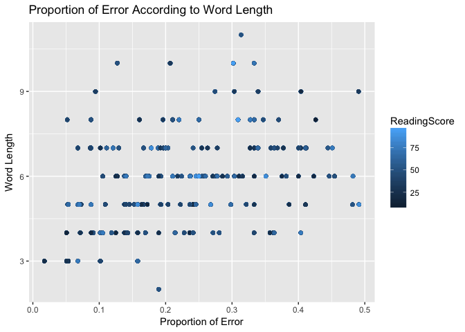
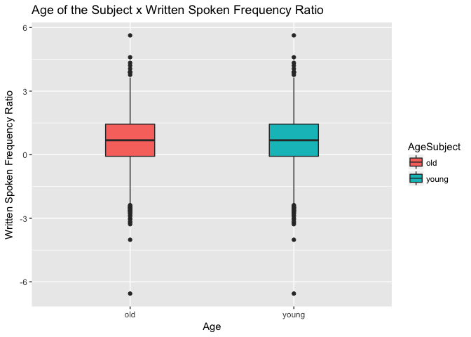
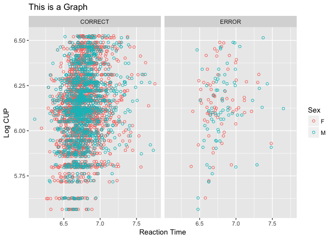

```{r}
library(tidyverse)
```

```
## ── Attaching packages ─────────────────── tidyverse 1.2.1 ──
```

```
## ✔ ggplot2 2.2.1     ✔ purrr   0.2.4
## ✔ tibble  1.4.2     ✔ dplyr   0.7.4
## ✔ tidyr   0.8.0     ✔ stringr 1.2.0
## ✔ readr   1.1.1     ✔ forcats 0.2.0
```

```
## ── Conflicts ────────────────────── tidyverse_conflicts() ──
## ✖ dplyr::filter() masks stats::filter()
## ✖ dplyr::lag()    masks stats::lag()
```

```{r}
library(languageR)
```

1. A bivariate scatterplot


```{r}
beginningReaders %>%
   ggplot(., aes(x = ProportionOfErrors, y = OrthLength, color = ReadingScore)) +
      geom_point() +
      labs(x = 'Proportion of Error', y = 'Word Length') +
      ggtitle('Proportion of Error According to Word Length')
```

<!-- -->

2. A boxplot


```{r}
english %>%
  ggplot(., aes(x = AgeSubject,
                y = WrittenSpokenFrequencyRatio, 
                fill = AgeSubject)) + 
    geom_boxplot(width = .3) +
    labs(x = 'Age', y = 'Written Spoken Frequency Ratio') +
    ggtitle('Age of the Subject x Written Spoken Frequency Ratio')
```

<!-- -->

3. A plot that includes a stat_summary and a facet


```{r}
danish %>%
  ggplot(., aes(x = LogRT, y = LogCUP, color = Sex)) +
  facet_grid(. ~ PrevError) + 
  stat_summary(fun.data = mean_cl_boot, 
               geom = 'point', shape = 1) +
  labs(x = 'Reaction Time', y = 'Log CUP') +
  ggtitle('This is a Graph')
```

<!-- -->


