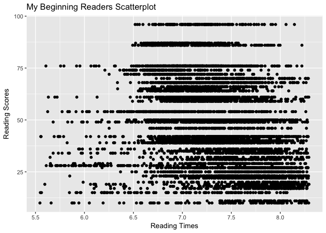
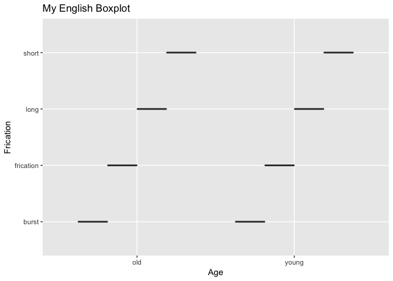
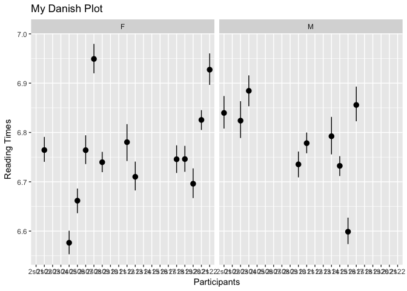

##Plot 1


```r
library(languageR)
library(tidyverse)
```

```
## ── Attaching packages ────────────────────────────────── tidyverse 1.2.1 ──
```

```
## ✔ ggplot2 2.2.1     ✔ purrr   0.2.4
## ✔ tibble  1.3.4     ✔ dplyr   0.7.4
## ✔ tidyr   0.7.2     ✔ stringr 1.2.0
## ✔ readr   1.1.1     ✔ forcats 0.2.0
```

```
## ── Conflicts ───────────────────────────────────── tidyverse_conflicts() ──
## ✖ dplyr::filter() masks stats::filter()
## ✖ dplyr::lag()    masks stats::lag()
```

```r
beginningReaders %>%
  select(., ReadingScore, LogRT) %>%
  ggplot(., aes(x = LogRT, y = ReadingScore)) +
  geom_point()+
  labs(x="Reading Times", y = "Reading Scores", title = "My Beginning Readers Scatterplot")
```

<!-- -->

```r
caption = "My Scatterplot"
```

##Plot2


```r
english %>%
  ggplot(., aes(x = VerbFrequency, y = Frication, color = VerbFrequency)) +
  geom_boxplot() +
  labs(x="Verb Frequency", y = "Frication", title = "My English Boxplot")
```

```
## Warning: position_dodge requires non-overlapping x intervals
```

<!-- -->

```r
caption = "My Boxplot"
```


##Plot3


```r
spanishFunctionWords %>%
ggplot(., aes(x = as.factor(X14458gll), y = X14463gll)) +
  stat_summary(fun.data = mean_cl_boot, geom = 'pointrange') + 
  facet_grid(X14459gll~X14464gll) +
  labs(x="X14458gll", y = "X14463gll", title = "My Spanish Function Words Plot")
```

```
## Warning: Removed 75 rows containing missing values (geom_pointrange).
```

<!-- -->

```r
caption = "My Plot"
```
