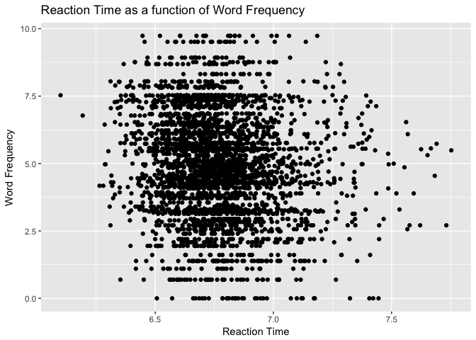
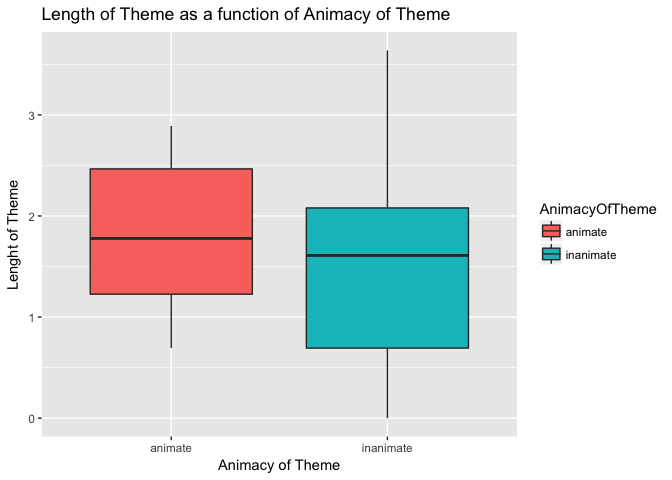

---

```r
library(languageR)
library(tidyverse)
```

```
## Loading tidyverse: ggplot2
## Loading tidyverse: tibble
## Loading tidyverse: tidyr
## Loading tidyverse: readr
## Loading tidyverse: purrr
## Loading tidyverse: dplyr
```

```
## Conflicts with tidy packages ----------------------------------------------
```

```
## filter(): dplyr, stats
## lag():    dplyr, stats
```

```r
library(ggplot2)
library(dplyr)

str(beginningReaders)
```

```
## 'data.frame':	7923 obs. of  13 variables:
##  $ Word              : Factor w/ 184 levels "avontuur","baden",..: 1 1 1 1 1 1 1 1 1 1 ...
##  $ Subject           : Factor w/ 59 levels "S10","S12","S13",..: 14 25 23 43 34 26 21 28 39 24 ...
##  $ LogRT             : num  7.41 8.07 6.74 7.02 7.17 ...
##  $ Trial             : int  190 298 172 295 74 446 94 415 342 361 ...
##  $ OrthLength        : int  8 8 8 8 8 8 8 8 8 8 ...
##  $ LogFrequency      : num  4.39 4.39 4.39 4.39 4.39 ...
##  $ LogFamilySize     : num  1.61 1.61 1.61 1.61 1.61 ...
##  $ ReadingScore      : int  39 34 61 66 41 23 28 60 87 39 ...
##  $ ProportionOfErrors: num  0.0877 0.0877 0.0877 0.0877 0.0877 ...
##  $ PC1               : num  -0.427 0.883 -1.008 -0.124 -0.489 ...
##  $ PC2               : num  0.179 -0.591 0.374 0.121 -0.958 ...
##  $ PC3               : num  0.09977 -0.9283 -0.00244 0.76438 0.19308 ...
##  $ PC4               : num  0.1031 -1.6583 -0.0156 0.3885 -1.28 ...
```

```r
str(danish)
```

```
## 'data.frame':	3326 obs. of  16 variables:
##  $ Subject       : Factor w/ 22 levels "2s01","2s02",..: 14 17 15 4 6 11 12 21 10 3 ...
##  $ Word          : Factor w/ 156 levels "appetitlig","arkiv",..: 1 1 1 1 1 1 1 1 1 1 ...
##  $ Affix         : Factor w/ 16 levels "bar","ede","en",..: 13 13 13 13 13 13 13 13 13 13 ...
##  $ LogRT         : num  6.45 6.84 6.84 6.83 6.8 ...
##  $ PC1           : num  0.544 1.129 0.655 -1.26 0.167 ...
##  $ PC2           : num  -0.233 -0.486 0.247 -2.433 0.443 ...
##  $ PrevError     : Factor w/ 2 levels "CORRECT","ERROR": 1 1 1 1 1 1 1 1 1 1 ...
##  $ Rank          : num  1.129 -0.838 -0.757 0.85 0.102 ...
##  $ Sex           : Factor w/ 2 levels "F","M": 2 2 2 2 1 2 1 1 2 2 ...
##  $ ResidSemRating: num  -1.23 -1.23 -1.23 -1.23 -1.23 ...
##  $ ResidFamSize  : num  -1.6 -1.6 -1.6 -1.6 -1.6 ...
##  $ LogWordFreq   : num  2.94 2.94 2.94 2.94 2.94 ...
##  $ LogAffixFreq  : num  13.4 13.4 13.4 13.4 13.4 ...
##  $ LogCUP        : num  6.46 6.46 6.46 6.46 6.46 ...
##  $ LogUP         : num  5.32 5.32 5.32 5.32 5.32 ...
##  $ LogCUPtoEnd   : num  4.3 4.3 4.3 4.3 4.3 ...
```

```r
str(english)
```

```
## 'data.frame':	4568 obs. of  36 variables:
##  $ RTlexdec                       : num  6.54 6.4 6.3 6.42 6.45 ...
##  $ RTnaming                       : num  6.15 6.25 6.14 6.13 6.2 ...
##  $ Familiarity                    : num  2.37 4.43 5.6 3.87 3.93 3.27 3.73 5.67 3.1 4.43 ...
##  $ Word                           : Factor w/ 2197 levels "ace","act","add",..: 467 2124 1838 1321 1302 1347 434 468 15 1632 ...
##  $ AgeSubject                     : Factor w/ 2 levels "old","young": 2 2 2 2 2 2 2 2 2 2 ...
##  $ WordCategory                   : Factor w/ 2 levels "N","V": 1 1 1 1 1 1 1 1 1 1 ...
##  $ WrittenFrequency               : num  3.91 4.52 6.51 5.02 4.89 ...
##  $ WrittenSpokenFrequencyRatio    : num  1.022 0.35 2.089 -0.526 -1.045 ...
##  $ FamilySize                     : num  1.39 1.39 1.61 1.95 2.2 ...
##  $ DerivationalEntropy            : num  0.141 0.427 0.062 0.43 0.359 ...
##  $ InflectionalEntropy            : num  0.0211 0.942 1.4434 0 1.7539 ...
##  $ NumberSimplexSynsets           : num  0.693 1.099 2.485 1.099 2.485 ...
##  $ NumberComplexSynsets           : num  0 0 1.95 2.64 2.48 ...
##  $ LengthInLetters                : int  3 5 6 4 4 4 4 3 3 5 ...
##  $ Ncount                         : int  8 5 0 8 3 9 6 13 3 3 ...
##  $ MeanBigramFrequency            : num  7.04 9.54 9.88 8.31 7.94 ...
##  $ FrequencyInitialDiphone        : num  12 12.6 13.3 12.1 11.9 ...
##  $ ConspelV                       : int  10 20 10 5 17 19 10 13 1 7 ...
##  $ ConspelN                       : num  3.74 7.87 6.69 6.68 4.76 ...
##  $ ConphonV                       : int  41 38 13 6 17 21 13 7 11 14 ...
##  $ ConphonN                       : num  8.84 9.78 7.04 3.83 4.76 ...
##  $ ConfriendsV                    : int  8 20 10 4 17 19 10 6 0 7 ...
##  $ ConfriendsN                    : num  3.3 7.87 6.69 3.53 4.76 ...
##  $ ConffV                         : num  0.693 0 0 0.693 0 ...
##  $ ConffN                         : num  2.71 0 0 6.63 0 ...
##  $ ConfbV                         : num  3.5 2.94 1.39 1.1 0 ...
##  $ ConfbN                         : num  8.83 9.61 5.82 2.56 0 ...
##  $ NounFrequency                  : int  49 142 565 150 170 125 582 2061 144 522 ...
##  $ VerbFrequency                  : int  0 0 473 0 120 280 110 76 4 86 ...
##  $ CV                             : Factor w/ 2 levels "C","V": 1 1 1 1 1 1 1 1 2 1 ...
##  $ Obstruent                      : Factor w/ 2 levels "cont","obst": 2 2 2 2 2 2 2 2 1 2 ...
##  $ Frication                      : Factor w/ 4 levels "burst","frication",..: 1 2 2 1 1 1 1 1 3 2 ...
##  $ Voice                          : Factor w/ 2 levels "voiced","voiceless": 1 2 2 2 2 2 1 1 1 2 ...
##  $ FrequencyInitialDiphoneWord    : num  10.13 9.05 12.42 10.05 11.8 ...
##  $ FrequencyInitialDiphoneSyllable: num  10.41 9.15 13.13 11 12.16 ...
##  $ CorrectLexdec                  : int  27 30 30 30 26 28 30 28 25 29 ...
```

```r
str(dativeSimplified)
```

```
## 'data.frame':	903 obs. of  5 variables:
##  $ RealizationOfRec: Factor w/ 2 levels "NP","PP": 1 1 1 1 1 1 1 1 1 1 ...
##  $ Verb            : Factor w/ 65 levels "accord","allocate",..: 19 23 23 23 36 23 38 9 59 23 ...
##  $ AnimacyOfRec    : Factor w/ 2 levels "animate","inanimate": 1 1 1 1 1 1 1 1 1 1 ...
##  $ AnimacyOfTheme  : Factor w/ 2 levels "animate","inanimate": 2 2 2 2 2 2 2 2 2 2 ...
##  $ LengthOfTheme   : num  2.64 1.1 2.56 1.61 1.1 ...
```

```r
str(spanishFunctionWords)
```

```
## 'data.frame':	120 obs. of  15 variables:
##  $ X14458gll: num  0.00816 0.00233 0.00233 0.00699 0.0035 ...
##  $ X14463gll: num  0.000938 0.00469 0.001876 0.016886 0 ...
##  $ X14459gll: num  0 0.0023 0.0023 0.02186 0.00345 ...
##  $ X14464gll: num  0.00102 0.00203 0.00203 0.01421 0.00203 ...
##  $ X14460gll: num  0.000609 0 0.007922 0.013406 0.000609 ...
##  $ X14465gll: num  0.000667 0.002 0.002667 0.016 0.001333 ...
##  $ X14461gll: num  0.000617 0.004316 0.003083 0.021578 0.003083 ...
##  $ X14466gll: num  0.002596 0.000649 0.002596 0.013628 0.001947 ...
##  $ X14462gll: num  0.00347 0.000578 0.002313 0.009832 0.000578 ...
##  $ X14472gll: num  0.000659 0.003955 0.003296 0.015821 0.000659 ...
##  $ X14467gll: num  0.00259 0.00259 0.00195 0.01816 0 ...
##  $ X14473gll: num  0.00499 0.00187 0.00187 0.0106 0.00312 ...
##  $ X14474gll: num  0.002045 0.001363 0.000682 0.019087 0.002727 ...
##  $ X14475gll: num  0.000679 0.002038 0.003397 0.012908 0.000679 ...
##  $ X14476gll: num  0 0.00321 0.00321 0.01798 0.00193 ...
```

```r
# Inside your pa2.Rmd file you will generate 3 different plots using
# ggplot2. You must use 3 of the aforementioned datasets (a different
# dataset for each plot). All plots must include informative x-, y-axis
# labels and a title. The plots you must create are:
#
# A bivariate scatterplot
# A boxplot with different fill colors
# A plot of your choice that includes a stat_summary and a facet.

# 1st Plot
ggplot(data = danish, aes(x = LogRT, y = LogWordFreq)) +
  geom_point() +
  labs(x = 'Reaction Time', y = 'Word Frequency', 
       title = 'Reaction Time as a function of Word Frequency')
```

<!-- -->

```r
# 2nd Plot
ggplot(data = dativeSimplified, aes(x = AnimacyOfTheme, y = LengthOfTheme, fill = AnimacyOfTheme)) +
  geom_boxplot() +
  labs(x = 'Animacy of Theme', y = 'Lenght of Theme', 
       title = 'Length of Theme as a function of Animacy of Theme')
```

<!-- -->

```r
# 3rd Plot
ggplot(data = beginningReaders, aes(x = LogRT, y = OrthLength)) +
    stat_summary(fun.data = mean_cl_boot, geom = 'pointrange') +
    facet_wrap(~ ReadingScore, nrow = 3) +
    labs(x = 'LogRT', y = 'OrthLength', 
       title = 'LogRT as a function of OrthLength')
```

```
## Warning: Removed 6972 rows containing missing values (geom_pointrange).
```

<!-- -->
