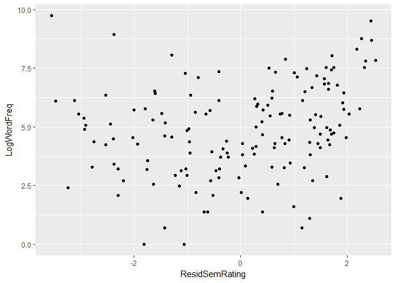
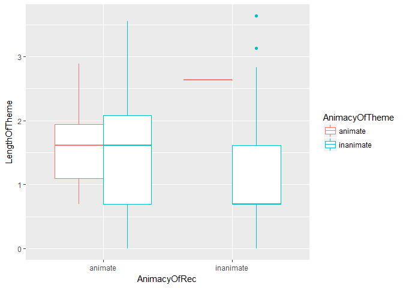
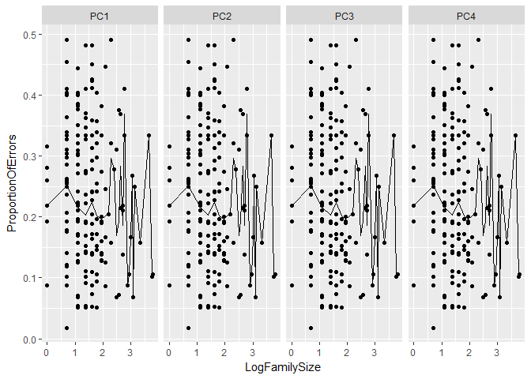

```r
library(languageR)
library(tidyverse)
```

```
## -- Attaching packages ------------------------- tidyverse 1.2.1 --
```

```
## v ggplot2 2.2.1     v purrr   0.2.4
## v tibble  1.4.2     v dplyr   0.7.4
## v tidyr   0.7.2     v stringr 1.2.0
## v readr   1.1.1     v forcats 0.2.0
```

```
## -- Conflicts ---------------------------- tidyverse_conflicts() --
## x dplyr::filter() masks stats::filter()
## x dplyr::lag()    masks stats::lag()
```

```r
ggplot(data = danish, aes(x = ResidSemRating, y = LogWordFreq)) + geom_point()
```

<!-- -->


```r
library(languageR)
library(tidyverse)

ggplot(data = dativeSimplified, aes(x = AnimacyOfRec, y = LengthOfTheme, color = AnimacyOfTheme)) + 
  geom_boxplot()
```

<!-- -->


```r
library(languageR)
library(tidyverse)

beginningReaders %>%
  select(., PC1, PC2, PC3, PC4, LogFamilySize, ProportionOfErrors) %>%
  gather(., key = person, val = value, -ProportionOfErrors, -LogFamilySize) %>%
  ggplot(., aes(x = LogFamilySize, y = ProportionOfErrors)) +
  stat_summary(fun.y = mean, geom="line") +
  facet_grid(. ~ person) +
    geom_point()
```

<!-- -->
